# LR6
Лабораторная работа №6
## Копия репозитория лабораторной работы в личное хранилище
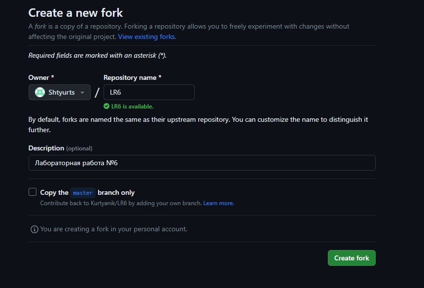
## Клонирование личного удалённого репозитория на компьютер
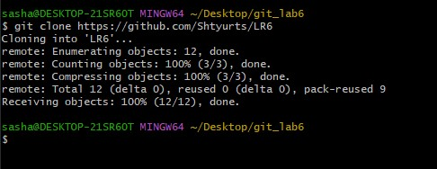
## Добавление файла через интерфейс GitHub
С помощью интерфейса GitHub был добавлен файл и сделан коммит  
</br>
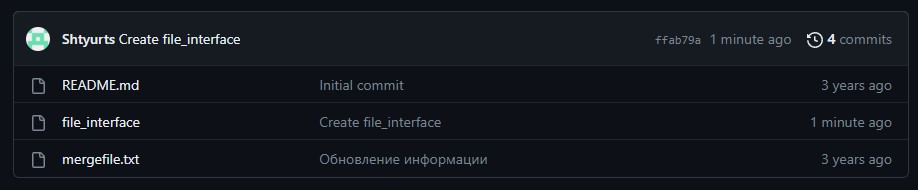
## Получение истории операций ветки master
С помощью команды git log была получена история операций  
</br>
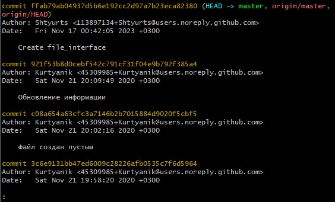
## Получение истории операций ветки branch1
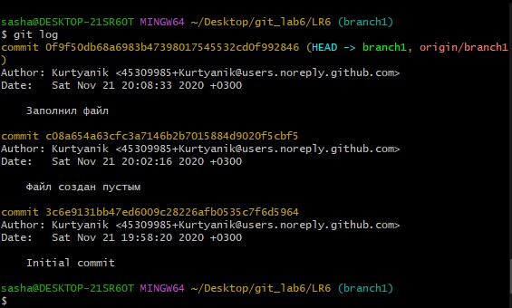
## Последние изменения
С помощью команды git show были получены последние изменения  
</br>
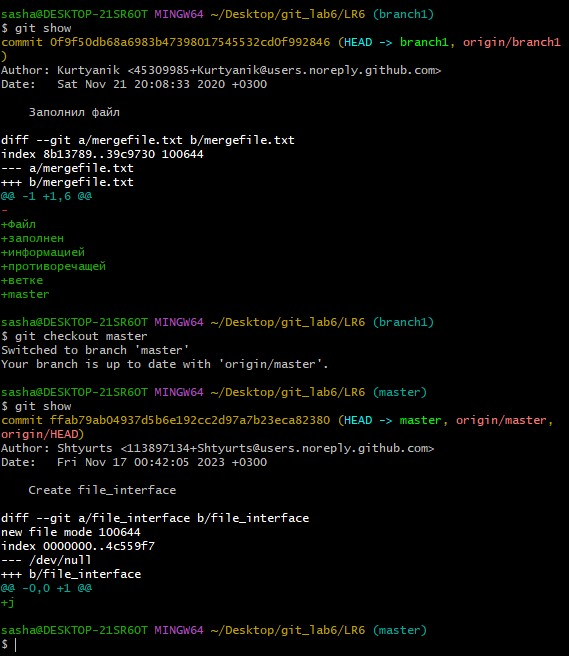
## Конфликт при попытке слияния
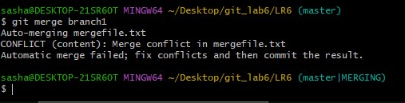
## Разрешение конфликта
Для разрешения конфликта были удалены разделители конфликта внутри конфликтующего файла.
После был сделан коммит для завершения слияния, согласно указаниям git  
</br>
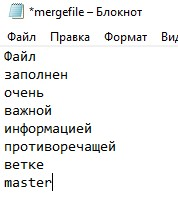
## Удаление побочной ветки
С помощью команд git branch -d branch1; git push origin -d branch1 была удалена побочная ветка branch1  
</br>
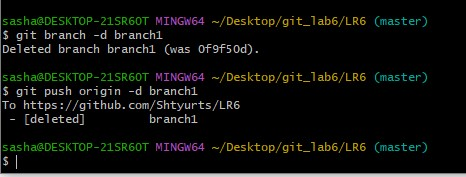
## Создание коммитов для отката
Были созданы 2 коммита с добавлением файла и с изменением содержания файла added_file.txt  
</br>
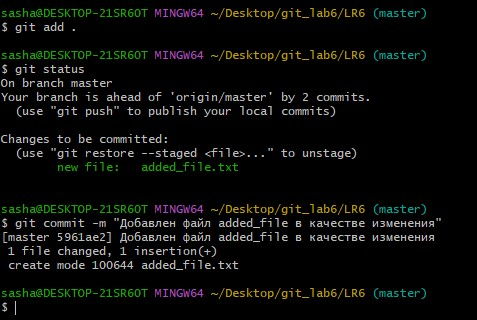
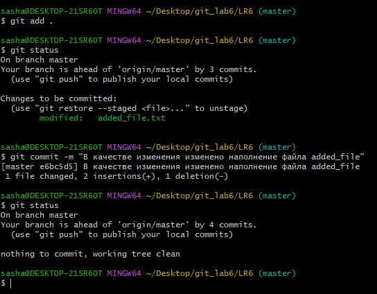
## Откат коммита
С помощью команды git reset --hard HEAD~ произведен откат коммита.
Было 4 коммита, стало 3 коммита  
</br>
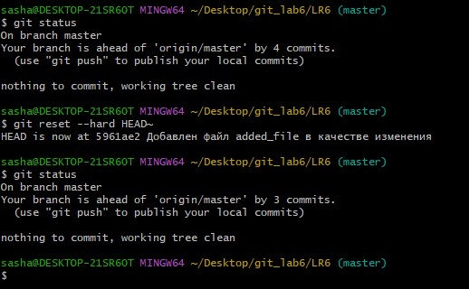
## Лог команд
```
git clone https://github.com/Shtyurts/LR6
cd LR6/
git pull
git log
git checkout branch1
git log
git status
git show
git checkout master
git show
git merge branch1
git merge branch1
git add .
git status
git merge branch1
git commit -m "Merge branch1->master"
git branch -d branch1
git push origin -d branch1
git add .
git status
git commit -m "Добавлен файл added_file в качестве изменения"
git add .
git status
git commit -m "В качестве изменения изменено наполнение файла added_file"
git status
git reset --hard HEAD~
git status
git branch protocol
git push origin protocol
git checkout protocol
git add .
git status
git commit -m "Добавлены скриншоты хода выполнения работы"
git push origin
git push origin protocol
```

## История операций в форматированном виде
```
368f989, Fri Nov 17 01:58:11 2023 +0300, Shtyurts, Добавлены скриншоты хода выполнения работы
5961ae2, Fri Nov 17 01:20:53 2023 +0300, Shtyurts, Добавлен файл added_file в качестве изменения
4e90c96, Fri Nov 17 01:00:15 2023 +0300, Shtyurts, Merge branch1->master
ffab79a, Fri Nov 17 00:42:05 2023 +0300, Shtyurts, Create file_interface
921f53b, Sat Nov 21 20:09:49 2020 +0300, Kurtyanik, Обновление информации
0f9f50d, Sat Nov 21 20:08:33 2020 +0300, Kurtyanik, Заполнил файл
c08a654, Sat Nov 21 20:02:16 2020 +0300, Kurtyanik, Файл создан пустым
3c6e913, Sat Nov 21 19:58:20 2020 +0300, Kurtyanik, Initial commit
```

# Вывод
Были изучены базовые возможности системы управления версиями, получен опыт работы с Git Api, опыт работы с локальным и
удаленным репозиторием.

